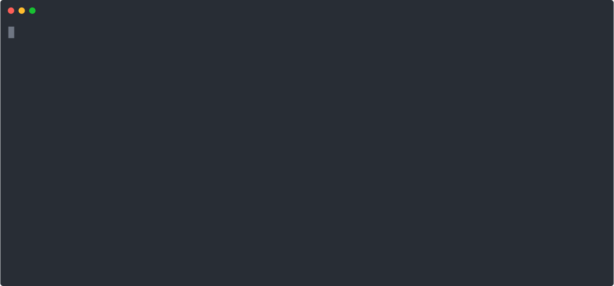

## Installation
1. Download MemeAssembly. This can be done either by [downloading the latest release](https://github.com/kammt/MemeAssembly/releases) or by cloning the GitHub repository using \
```git clone https://github.com/kammt/MemeAssembly.git```
2. Open a terminal and set the current directory so that you are in the root directory of the project
3. 
    - Install the compiler in */usr/bin* by typing ```sudo make install```. Root priveleges are required for this.
    - Simply compile the project by typing ```make all```. The executable is now in the current working directory.

## Compiler usage
- ```memeasm (-c | --compile) [-v | -vv] sourceFile destinationFile``` - only compiles the specified file
- ```memeasm [-v | -vv] sourceFile``` - compiles and runs the specified file

-v enables information logs and -vv debug logs. Furthermore, you can use ```memeasm --help``` to open a help page.

## Hello World
So let's create our first program! 
1. Create a new file and name it "HelloWorld.memeasm"
2. Now open it using a text editor of your choice and paste the following code into it:
    ```
    what can I say except H
    what can I say except e
    what can I say except l
    what can I say except l
    what can I say except o
    what can I say except \s
    what can I say except W
    what can I say except o
    what can I say except r
    what can I say except l
    what can I say except d
    what can I say except !
    what can I say except \n
    ```
3. Open a terminal in the directory of your file and type ```memeasm HelloWorld.memeasm```
4. Voilà! The output of your program is <br>
 
